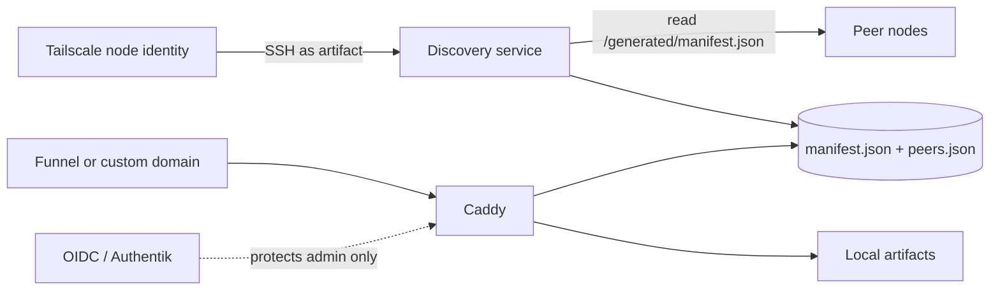

# Artifact Platform

A self-hosted mesh for small static web tools, dashboards, and documents. Each
device serves its own artifacts, discovers every other platform node on the
tailnet, and presents the combined catalog through a control-plane interface.

The default deployment is intentionally low-friction:

- local preview works before Tailscale is configured;
- Tailscale enrollment can use its one-time browser login, with no auth key;
- peers authenticate through Tailscale SSH node identity, with no SSH keypair;
- all discovered platform nodes mesh by default;
- operators can exclude peers or artifacts and add or override endpoints;
- artifacts can be published through Tailscale Funnel;
- an optional custom-domain mode adds Authentik-compatible OIDC SSO and an
  administrator-only configuration surface.

## Local preview

```sh
docker compose up -d
open http://localhost:8765
```

This requires no Tailscale account, key, or public endpoint. Put an artifact
in `artifacts/<slug>/index.html`; Caddy serves it immediately.

## Mesh architecture



The `tailscale`, `caddy`, and `discovery` containers share one network
namespace. Discovery asks the local Tailscale daemon for online devices, then
runs the exact remote command `cat /generated/manifest.json` through
`tailscale ssh artifact@<peer>`. Tailscale authenticates both nodes; OpenSSH
private keys and `authorized_keys` are never generated or distributed.

Peer manifests are treated as untrusted data. The discovery service validates
their shape, rebuilds safe public URLs, filters excluded artifact slugs, and
atomically writes the public catalog.

## Join a tailnet without keys

The tailnet needs a one-time policy installation. Copy
[`platform/tailscale/policy.example.hujson`](platform/tailscale/policy.example.hujson)
into the Tailscale policy editor, or merge its `tagOwners`, `grants`, `ssh`, and
`nodeAttrs` sections into an existing policy. The enrolling user must be a
Tailscale admin because the default compose stack automatically advertises
`tag:artifact-platform`.

Then start each node without setting `TS_AUTHKEY`:

```sh
cp .env.example .env
docker compose up -d
docker compose logs tailscale
```

Open the login URL shown once in the logs. That browser approval enrolls the
node; it is not an SSH key and there is nothing for an end user to create,
copy, or rotate. Persistent node identity lives in the `tailscale-state`
volume. Detailed setup and verification are in
[`docs/tailscale-ssh.md`](docs/tailscale-ssh.md).

After enrollment, the public catalog is available at the node's Funnel URL:

```text
https://<TS_HOSTNAME>.<tailnet>.ts.net/
```

## Default mesh and manual controls

Every online node tagged `artifact-platform` is included automatically. The
versioned operator file is [`config/mesh.json`](config/mesh.json):

```json
{
  "version": 1,
  "excluded_peers": ["retired.tailnet-name.ts.net"],
  "peers": {
    "lab.tailnet-name.ts.net": {
      "public_url": "https://artifacts.example.com/lab",
      "excluded_artifacts": ["private-dashboard"]
    },
    "manual.example": {
      "manual": true,
      "ssh_target": "100.64.0.20",
      "public_url": "https://manual.example.com"
    }
  }
}
```

You can edit this file directly. Invalid edits are rejected and the last valid
configuration remains active. A discovered peer can override `ssh_target`,
`public_url`, or `excluded_artifacts`; a manual peer additionally requires both
endpoints. Removing a rule returns that peer to automatic behavior.

## SSO and the admin scope

The base/Funnel mode deliberately returns 404 for `/admin`, `/admin.html`,
`/admin.js`, `/api/admin/*`, and `/oauth2/*`. The administration surface only
exists when the SSO overlay is enabled.

For a custom-domain deployment:

```sh
cp .env.example .env
openssl rand -hex 32          # MANAGEMENT_API_TOKEN
openssl rand -base64 32       # OIDC_COOKIE_SECRET
docker compose -f docker-compose.yml -f docker-compose.sso.yml up -d
```

Set `SITE_ADDRESS`, the Authentik issuer/client values, and the permitted group
in `.env` first. Caddy delegates admin authentication to OAuth2 Proxy, which
uses generic OIDC and requires membership in `artifact-platform-admins` by
default. The internal management bearer token is injected by Caddy and is
never sent to the browser. See [`docs/authentik.md`](docs/authentik.md) for the
exact provider and callback configuration.

## Artifact convention

```text
artifacts/
└── world-clock/
    ├── index.html
    ├── meta.json
    └── ...
```

`meta.json` is optional and may contain `title` and `description`. Scaffold an
artifact with:

```sh
scripts/new-artifact.sh world-clock "World Clock" "Timezones at a glance"
```

See [`ARTIFACTS.md`](ARTIFACTS.md) and `templates/` for the authoring contract
and starter layouts.

## Configuration

Copy `.env.example` to `.env`. Important values are:

| Variable | Default | Purpose |
| --- | --- | --- |
| `TS_AUTHKEY` | blank | Optional unattended enrollment; blank uses browser login |
| `TS_HOSTNAME` | `artifacts` | Unique MagicDNS/Funnel node name |
| `LOCAL_PREVIEW_PORT` | `8765` | Loopback-only preview port |
| `DISCOVERY_INTERVAL` | `120` | Seconds between mesh refreshes |
| `DISCOVERY_FETCH_TIMEOUT` | `5` | Tailscale SSH deadline per peer |
| `MANAGEMENT_API_TOKEN` | blank | Required only by the SSO admin overlay |
| `SITE_ADDRESS` | — | Custom public hostname for SSO mode |
| `OIDC_ISSUER_URL` | — | Authentik application issuer URL |
| `OIDC_CLIENT_ID` / `OIDC_CLIENT_SECRET` | — | OIDC client credentials |
| `OIDC_COOKIE_SECRET` | — | OAuth2 Proxy session encryption secret |
| `OIDC_ADMIN_GROUP` | `artifact-platform-admins` | Group allowed into admin |

## Development

Requires Docker, uv, Node.js, and shellcheck.

```sh
make lint
make unit
make build
make integration
make integration-sso
npm ci && npx playwright install chromium webkit
make ui
make check
```

GitHub Actions runs six separately protected jobs on pushes and pull requests:
lint, unit, image/config build, public HTTP integration, SSO integration, and
desktop/mobile browser tests. The default-branch ruleset requires all six plus
one approving review and resolved review threads, blocks deletion and force
pushes, and grants an explicit always-bypass to repository administrators.

Live Tailscale enrollment, Funnel certificate issuance, and real Authentik
login require those external systems and are covered by the operational
runbooks rather than CI.

## Troubleshooting

- `tailscale ssh` is denied: confirm both nodes advertise
  `tag:artifact-platform` and the policy contains the supplied `accept` SSH
  rule for user `artifact`.
- A node is absent: check `docker compose exec tailscale tailscale status` and
  `docker compose logs discovery`; excluded peers are intentionally omitted.
- Funnel is unavailable: confirm the node has the `funnel` attribute and HTTPS
  certificates are enabled for the tailnet.
- SSO loops or returns 403: verify the exact issuer/callback URLs and that the
  ID token contains the configured group in its `groups` claim.
- Recreating the Tailscale sidecar can detach shared network namespaces;
  restart `caddy`, `discovery`, and `oauth2-proxy` after replacing it.
