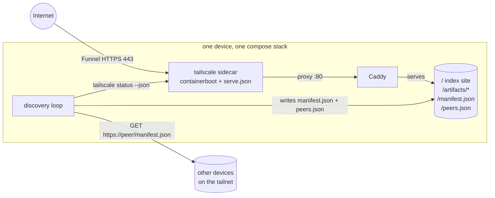

# artifact-platform

Per-device hosting for small Claude-built web artifacts, published to the
internet via [Tailscale Funnel](https://tailscale.com/kb/1223/funnel).

Each device that runs this stack is fully self-contained: it serves whatever
is in its own `artifacts/` folder at `https://<device>.<tailnet>.ts.net/`.
Devices discover each other over the tailnet automatically and cross-link to
whatever the others are hosting — nothing is centralized, no device depends on
any other, and there is no peer list to maintain.

This repo is the reusable scaffold (compose stack, configs, discovery code).
Hosted content under `artifacts/` is deliberately **not** committed.

## How it works



Three services share the Tailscale sidecar's network namespace
(`network_mode: service:tailscale`):

- **tailscale** — joins the tailnet, terminates HTTPS, and (per
  `platform/tailscale/serve.json`) exposes port 443 to the internet with
  Funnel, proxying to Caddy on `127.0.0.1:80`.
- **caddy** — serves the index site, everything under `artifacts/` (with
  directory listings), and the generated `manifest.json` / `peers.json`.
- **discovery** — every `DISCOVERY_INTERVAL` seconds (default 120):
  1. Rebuilds `manifest.json` from `artifacts/*/meta.json` (the slug stands in
     for a missing/malformed title).
  2. Asks the local tailscaled for online peers (`tailscale status --json`).
  3. Fetches `https://<peer>/manifest.json` from each — by Tailscale IP, with
     TLS validated against the peer's MagicDNS name, under a hard deadline.
  4. Writes every valid response into `peers.json`. Peers that time out, 404,
     or return garbage are skipped silently: they're just not running the
     platform, which is expected, not an error.

The index page (`/`) renders both JSON files client-side: "on this device" and
"other devices on the tailnet", with friendly empty states on first boot.

## Artifact convention

```
artifacts/
└── world-clock/
    ├── index.html    # required — the artifact itself
    ├── meta.json     # optional: {"title": "...", "description": "..."}
    └── ...           # any other static assets
```

Scaffold one with:

```sh
scripts/new-artifact.sh world-clock "World Clock" "Timezones at a glance"
```

Dropping a folder in is enough — Caddy serves it immediately and the next
discovery pass adds it to `manifest.json`. No restarts.

## Standing up a device

One-time tailnet prep (admin console):

1. **Enable HTTPS certificates** and **MagicDNS** (DNS page).
2. **Allow Funnel** in the tailnet policy file — the node needs the `funnel`
   node attribute:

   ```json
   "nodeAttrs": [
       { "target": ["autogroup:member"], "attr": ["funnel"] }
   ]
   ```

   If you authenticate the container with a tagged key, target the tag
   (e.g. `"target": ["tag:artifacts"]`) instead of `autogroup:member`.
3. Create an auth key: <https://login.tailscale.com/admin/settings/keys>.

Per device:

```sh
cp .env.example .env      # paste the auth key, pick a unique TS_HOSTNAME
docker compose up -d
```

Then verify:

```sh
docker compose exec tailscale tailscale status   # joined the tailnet?
docker compose exec tailscale tailscale funnel status
curl https://<TS_HOSTNAME>.<tailnet>.ts.net/manifest.json
```

The device appears on other devices' index pages within one discovery
interval, and vice versa.

## Configuration

All optional, via `.env` (see `.env.example`):

| Variable | Default | Meaning |
| --- | --- | --- |
| `TS_AUTHKEY` | — | Tailscale auth key (required to join the tailnet) |
| `TS_HOSTNAME` | `artifacts` | Device name → `https://<name>.<tailnet>.ts.net` |
| `DISCOVERY_INTERVAL` | `120` | Seconds between discovery passes |
| `DISCOVERY_FETCH_TIMEOUT` | `5` | Per-peer fetch timeout in seconds |
| `DISCOVERY_LOG_LEVEL` | `INFO` | Discovery log verbosity |

## Development and testing

Requires [uv](https://docs.astral.sh/uv/), Docker, and shellcheck.

```sh
make lint          # shellcheck + ruff (lint & format)
make unit          # pytest unit tests for the discovery service
make build         # docker compose config + image build
make integration   # real Caddy + fixtures over HTTP on 127.0.0.1:8480
make check         # all of the above
```

CI (`.github/workflows/ci.yml`) runs the same four targets on every push and
pull request.

- **Unit tests** cover the discovery logic in isolation: manifest building
  against artifact trees with present/absent/partial/malformed `meta.json`,
  `tailscale status` parsing (offline peers, missing DNS names, CLI failures),
  peer aggregation (timeouts, 404s, garbage responses, fetchers that raise or
  hang), and atomic file writes.
- **Integration tests** bring up the real Caddyfile and index site in Docker
  with fixture content and assert status codes, content types, caching
  headers, directory listings, and 404 behavior over real HTTP.

### What's not covered by CI

Automated tests exercise everything that can run without Tailscale
credentials. They do **not** verify:

- real Funnel reachability from the public internet,
- certificate issuance for the `ts.net` name,
- multi-device cross-discovery over an actual tailnet.

Those need a real auth key on real devices: stand up two devices as above and
check each one's index page lists the other. The discovery loop's tailnet
interactions are tested against mocked `tailscale status` output and a mocked
HTTP layer, not a live daemon.

## Repo layout

```
docker-compose.yml        # the real three-service stack
docker-compose.test.yml   # Caddy-only stack for integration tests
platform/
├── caddy/Caddyfile
├── tailscale/serve.json  # Funnel + proxy config (TS_CERT_DOMAIN templated)
├── discovery/            # Python discovery service + unit tests
└── site/index.html       # the index page
scripts/new-artifact.sh   # scaffold a new artifact
tests/integration/        # HTTP tests + fixtures for the test stack
artifacts/                # your hosted content (gitignored)
```

## Troubleshooting

- **Node joined but `https://…ts.net` times out from the internet** — Funnel
  isn't active: check `tailscale funnel status` inside the sidecar and confirm
  the `funnel` node attribute targets this node (tag vs. member!).
- **Site up but peers never appear** — peers must also run this stack and be
  online; check `docker compose logs discovery` (set
  `DISCOVERY_LOG_LEVEL=DEBUG` to see why individual peers were skipped).
- **Device shows up as `artifacts-1`** — hostname collision on the tailnet;
  set a unique `TS_HOSTNAME` in `.env`.
- **Wiping a device's identity** — `docker compose down -v` removes the
  Tailscale state volume; the next `up` joins as a fresh node (needs a valid
  auth key in `.env`).
